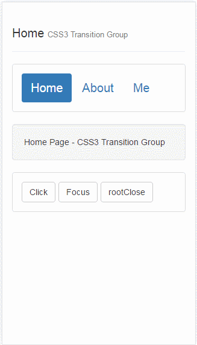

# react-css3-transition-group
手机端配合react-route转场动画案例初探

## 用法

```javascript
npm install
npm run dll
npm run start
```

## 代码说明

* 采用react-addons中提供的css3动画效果

* 搭配react-route进行路由切换

* 设置组件进入和退出的css样式(通过transform搭配transition动画)

## 代码核心

```javascript
<ReactCSSTransitionGroup 
    className="transition-wrapper"
    component="div" 
    style={{height:'100%'}} 
    transitionName={this.state.transitionName}
    transitionEnterTimeout={200} 
    transitionLeaveTimeout={200}>
    <div key={this.props.location.pathname} style={{position:"absolute", width: "100%", height: '100%'}}>
        { React.cloneElement(this.props.children || <div />, {
            setTransition : this.setTransition,
            transitionName : this.state.transitionName
        }) }
    </div>
</ReactCSSTransitionGroup>
```
通过切换`transitionName`达到页面接入或者是退出的应该执行的动画

***重点说明***

1. `ReactCSSTransitionGroup`中的`div`必须使用`style`样式，保证页面中心重叠，因为切换开始时，实际上是两个页面同事存在的

2. 不能在`ReactCSSTransitionGroup`上直接加`style`，必须内嵌一个`div`才用切换效果

------------

**思考方案1：**

采用redux管理`transitionName`，在需要前进或者退出的时候，改变redux中的数据，达到动画切换（redux方案中的样式未用bootstrap,比较简陋）

**思考方案2：**

采用添加中间过渡页，通过子组件改变父组件中的`transitionName`达到相同的目的

## 效果图

